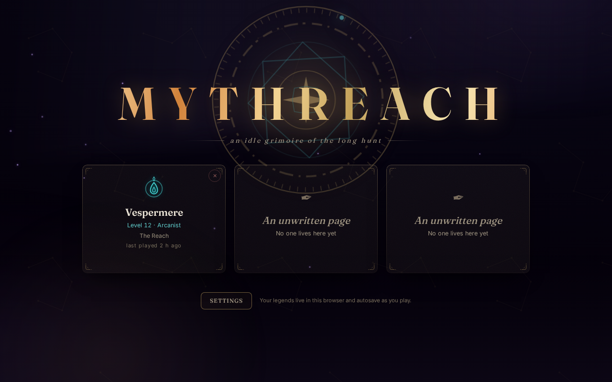
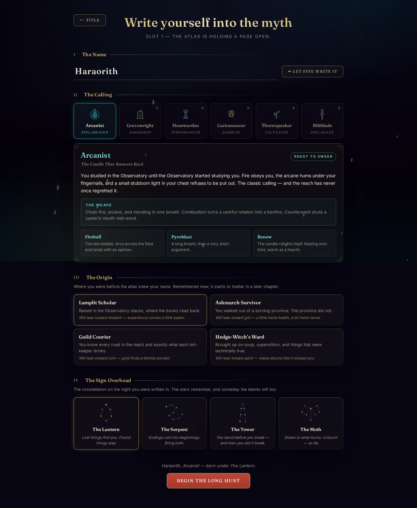
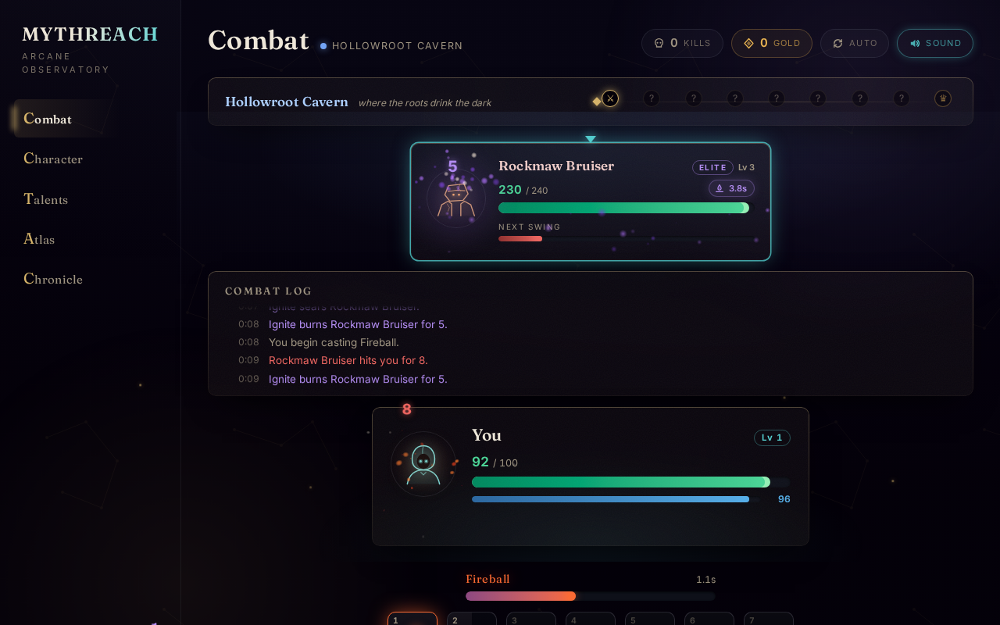
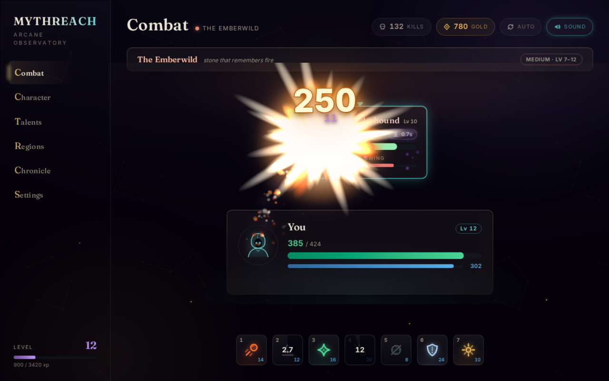
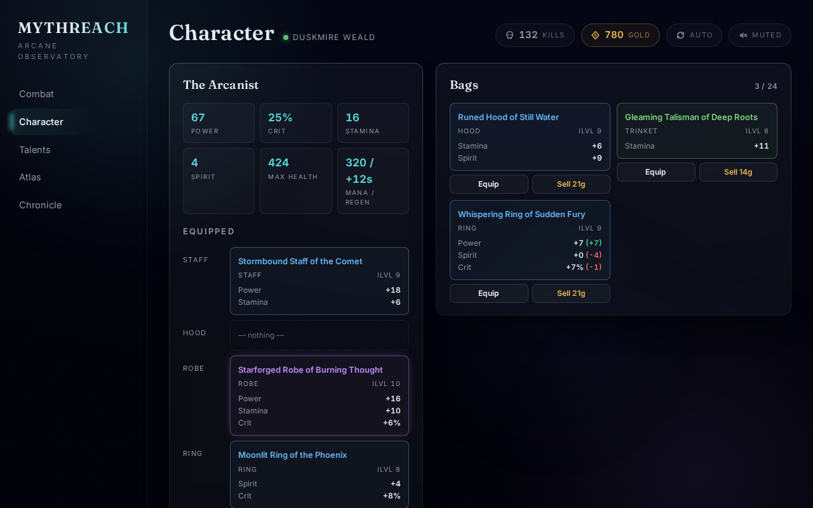
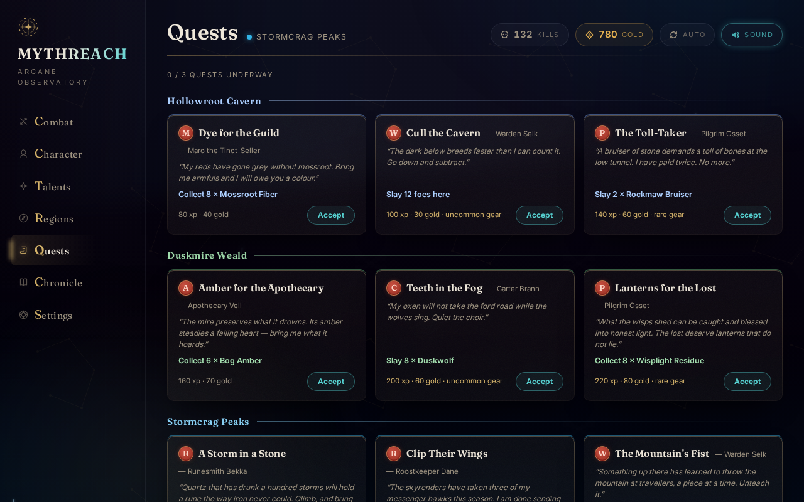

# Mythreach

**An RPG you actually play — and your absence is simply respected.**

Mythreach is a dashboard RPG with the clean presentation of the incremental
genre's best — and a combat system you actually *play*: an MMO-style action bar
with cast times, cooldowns, a global cooldown with spell queueing, interrupts,
and healing decisions under pressure. It is **active-only**: no away-from-game
progression, no passive accrual. When you step away, the world simply waits for
you.

The current build is a complete single-player game: a title screen with three
save slots and a character-creation ceremony, five free-choice hunting regions,
thirty-five enemies fought as discrete pack encounters, seven abilities, mana,
crits, XP and levels, loot with rarities, crafting materials, fifteen traveler
quests, talents, achievements, a persistent world boss, a hireling companion,
auto-battle, and local saves — all driven by one deterministic, pure engine.



## The concept

You run a hero's whole life from a command dashboard — skills ticking,
resources accruing, numbers climbing. But when a fight matters, you take the
controls yourself and outplay the encounter. The player is both an *operator*
(efficient, organized, always progressing) and a *raider* (executing a
rotation, clutching a heal at 10% HP).

Design pillars:

1. **The dashboard is the world.** No 3D, no sprites, no art pipeline. Cards,
   bars and floating numbers carry the entire fight — an aesthetic commitment
   that keeps information density high and runs anywhere.
2. **But the cards are a stage, not a spreadsheet.** Spells are *thrown* from
   one card to the other. They gather in your hand, cross the gap, and
   detonate. Fire clings to what it burns. The presentation is austere by
   design and violent on purpose.
3. **Hands-on combat is the differentiator.** The dashboard audience wants
   moments of mastery. Active play (rotations, cooldown usage, interrupt timing)
   meaningfully beats passive play without being mandatory — the auto-battle
   echo runs a sensible priority, but it doesn't burst bosses like you do.
4. **Respect absence — don't simulate it.** The game is active-only: no
   away-from-game catch-up and no passive accrual. Close the tab and nothing
   happens; your absence is respected by the world simply waiting for you.
   Auto-battle is an active-session assist (tab open, you present), and you
   heal quickly between fights.
5. **Numbers you can feel.** A damage number's *size is its value*. A burn tick
   is a small violet 11; a Pyroblast crit is an enormous stroked 240 that
   overshoots, snaps back and hangs in the air while the card it hit is still
   reeling. You never have to read a number to know how hard it landed.

The wedge, in one sentence: **the dashboard RPG where combat is real and your
time is your own.**

## The game

The game opens on the title screen: three save slots, a settings panel (sound,
screen shake, reduced motion), and — on an unwritten page — the
**character-creation ceremony**: name your hero (or let fate write it), choose
a calling, an origin, and the constellation you were born under.



**All six callings are playable**, each with its own kit, talents, resource
and auto-battle brain: the **Arcanist** (the classic rotation), the
**Gravewright** (kills become ledger pages; pages become pets, heals, or one
enormous Final Chapter), the **Hourwarden** (everything is instant, everything
is borrowed, and every 16 seconds the Reckoning collects), the **Cartomancer**
(a visible hand of fate cards, with control valves for the variance), the
**Thornspeaker** (a briar that grows every tick — let it ride or harvest it),
and the **Riftblade** (build rift charges with fast strikes, spend them all on
one edge; lock a pack outside a Doorway Duel). Origins lean (+XP, +HP, +gold,
+regen) and birth signs intervene — the Tower turns one killing blow per fight
into 1 HP. Design notes per class live in `docs/CLASSES.md`; mechanics live in
the engine (`src/engine/content/classes.ts`, `identity.ts`), while the lore
and constellation art stay UI-side (`src/ui/content/identity.ts`).

In the world, your hero hunts across **five free-choice regions** —
Hollowroot Cavern to the Ruined Spire, level bands 1–3 up to 13–15, all open
from the start, none gated. Combat comes as **discrete, player-started
fights**: press Start fight (or let auto-battle chain them) and a pack of one
to three mobs spawns — a lone brute, a pair, or a vanguard of minions screening
something meaner casting in the back row. Click a card (or Tab) to switch
targets; Counterspell only reads *your target's* lips, so the caster hiding
behind its whelps is your problem to solve. When the pack falls, the fight ends
in a **looting phase**: each corpse banks its own gold, materials and items —
collect per card, or sweep the field with `R`.

**The spellbook** (keys `1`–`7`, unlocked by level):

| Key | Ability | Type | What it does |
|-----|---------|------|--------------|
| `1` | Fireball | 2.2 s cast | 16–24 fire damage, the filler |
| `2` | Ignite | Instant, 8 s CD | burn: 5/s for 6 s, refreshable |
| `3` | Renew (Lv 2) | 1.8 s cast, 5 s CD | heals 20–28, scales with spirit |
| `4` | Pyroblast (Lv 4) | 3.5 s cast, 12 s CD | 48–64 fire damage |
| `5` | Counterspell (Lv 6) | Instant, off-GCD, 15 s CD | interrupts your target's hardcast — switch to the caster first |
| `6` | Arcane Barrier (Lv 8) | Instant, 20 s CD | absorb shield, 25 + 5/level |
| `7` | Combustion (Lv 11) | Instant, 30 s CD | 12 s: +25% fire damage, +20% crit |

Combat runs on a 1.2 s global cooldown with a forgiving spell queue: press
anything during a cast or GCD and it fires the moment it legally can. Mana
regenerates on a spirit-scaled clock and is the throttle on your burst. Spells
crit for 175%. Cooldowns start when an ability *resolves*; casts whose target
died mid-flight fizzle and refund their mana.

**Enemies fight back with mechanics**: elites and bosses *enrage* below 30%
HP (faster, harder swings), casters wind up interruptible *hardcasts*, and
venomous creatures stack damage-over-time on you.

**Progression**: XP → levels 1–15 (new spells, talent points, full restore),
gold, and generated items in four rarities across five slots — power, stamina,
spirit, and crit budgets that scale with item level. Six talents with five
ranks each shape your build; respec costs 50 gold. Ten **crafting materials**
drop by region tier — inert for now, they stack, sell, and wait for a crafting
system. Seventeen achievements track your deeds.

**Quests**: fifteen one-shot traveler quests on the Quests board — kill or
collect objectives tied to a region, up to three underway at once, paying XP,
gold, and sometimes gear. Each giver speaks in their own voice; abandon freely,
turn in when the traveler pays up.

**Scaffolds of the multiplayer future**: systems shipped single-player for
features a server would someday own. **The Rift Colossus** is a world boss with
a persistent HP pool that survives across assaults, banking your damage each
time and paying out when felled. **Records** track world-boss fells and best
assault damage. And you can **hire a companion** — a sellsword who fights at
your side on her own timer.

### Run it

```sh
npm install
npm run dev
```

| Script | What it does |
|--------|--------------|
| `npm run dev` | dev server with HMR |
| `npm run build` / `preview` | production build / serve it |
| `npm test` | the contract — 175 Vitest cases incl. an engine-purity guard and a progression balance envelope |
| `npm run check` | svelte-check + tsc, strict mode |
| `npm run shots` | build + headless Playwright screenshots into `docs/` (first run: `npx playwright install chromium`) |

## Architecture

Three layers with hard boundaries, plus a test suite that acts as the spec:

```
src/engine/   pure TypeScript simulation — no DOM, no Svelte, no window
src/ui/       Svelte 5 (runes) presentation over the engine
src/ui/fx/    the combat effects layer — declarative, data-driven
tests/        the behavioral contract
```

### The engine: a fixed-timestep integer simulation

The engine runs at **20 ticks per second**; every duration in the game is an
exact tick count (fireball cast 44, GCD 24, burn interval 20, respawn 100).
There are no floats and no wall-clock time inside the simulation, which makes
every rule exactly testable: *"damage lands on tick 44 and not on 43"* is an
assertion, not a hope.

`GameSim` is the whole game — combat **and** progression — behind a few moves:

```ts
const sim = new GameSim({ rng })   // rng is required — the engine owns no wall clock
sim.startFight()             // raise the next pack in the current region
sim.useAbility('fireball')   // start, queue, or refuse
sim.tick()                   // advance exactly one tick → CombatEvent[]
sim.collectLoot(iid)         // claim one corpse's spoils (or collectAllLoot())
sim.combatSnapshot()         // phase, HP/mana/shield, casts, cooldowns, pack state
sim.progressSnapshot()       // level, gold, gear, talents, regions, quests, records
```

Everything else follows from a few load-bearing ideas:

- **Events out, not callbacks in.** `tick()` returns a `CombatEvent[]`
  discriminated union (~25 kinds: damage with crit/absorb detail, casts,
  interrupts, enrages, loot, level-ups, quest flow, achievements). The UI
  drains each tick's events exactly once and derives *all* one-shot effects
  (floats, shakes, sounds, toasts) from them — never from state diffs.
- **Content is data.** The bestiary, regions, encounter tables, item affixes,
  materials, quests, talents, and achievements are plain typed objects in
  `src/engine/content/`. Enemy *mechanics* (enrage / hardcast / venom) are a
  tagged union the engine interprets — a new monster is data, not logic. Tests
  inject tiny custom content packs to pin rules independently of live balance
  numbers.
- **Injected RNG, required.** The engine takes its randomness as a constructor
  option — seeded mulberry32 in tests, the platform PRNG in the game — and has
  no `Math.random` default and no wall clock of its own. Loot, crits, enemy
  rolls, and encounter picks all flow through it, which is why the balance
  suite can Monte-Carlo the entire arc headlessly. A `purity.test.ts` reads
  every engine source and fails the build on any ambient global, `Date.now`, or
  reach into the UI world. Saves are **v4** (v1–v3 saves still load, their dead
  fields ignored); live fight state is never persisted — reload and the field
  is clear.
- **Active-only, by construction.** There is no away-from-game path.
  `src/ui/loop.ts` discards a backgrounded tab's gap rather than replaying it, so
  absence never progresses the game.

### The UI: a 60 fps view of a 20 Hz truth

The app opens on a **title screen** (`src/App.svelte` is a small screen
machine: title → character creation → game). Three **save slots** live in
`src/ui/profile.ts` — slot 1 keeps the original save key, so pre-title-screen
characters surface on it unmigrated — alongside per-slot identity profiles
(name, class, origin, birth sign) and shared settings (sound, screen shake,
reduced motion, the latter stamping `data-motion` on the document for CSS).
The engine save never learns any of this exists.

`src/ui/loop.ts` is a `requestAnimationFrame` accumulator stepping the sim once
per elapsed 50 ms. `src/ui/game.svelte.ts` is the bridge: a runes-based `Game`
store that owns the sim for one slot, publishes snapshots, and autosaves to
`localStorage` every five seconds. It hands every event to the FX director
(below), which decides *when* each number, recoil and sound actually happens —
a fireball's damage is dealt on the tick the sim says so, but it isn't *shown*
until the bolt lands.

Seven views hang off a sidebar: **Combat** (the pack in formation up top, your
card above the action bar), **Character** (stats, paper-doll, bags with
stat-delta compare, materials), **Talents**, **Regions** (free travel and the
Rift Colossus panel), **Quests** (the traveler board), **Chronicle** (lifetime
stats, records, achievements), and **Settings** (identity, save management,
return to title). The sim never pauses while you shop.

### The combat FX: effects as data

The fight is staged on a PixiJS canvas laid across the whole battlefield. The interesting
part isn't the particles — it's that **no code anywhere describes what a spell
looks like**. Effects are declarative:

```ts
// src/ui/fx/spells.ts — the only file with opinions about a specific spell
fireball: {
  tone: TONE.fireball, deep: TONE_DEEP.fireball, css: 'var(--tone-fireball)',
  charge:     { rate: 0.022, radius: 62, tighten: 0.55 },   // motes spiral into your hand
  projectile: { flight: 0.14, size: 20, arc: -18, /* … */ },// it crosses the arena
  impact:     [ ...DETONATE(78, 250), DEBRIS(32, 760, 19),
                { fx: 'rays', tint: 'hot', count: 6, reach: 150, width: 10 },
                { fx: 'shake', amp: 6 } ],
  crit:       CRIT_FLOURISH,
  sfx:        { release: 'cast', impact: 'hit', crit: 'crit' },
},
```

Adding an ability is ~24 lines in that table plus a colour token — the director,
the stage, the recipe engine and every component are untouched.
**[`docs/EXTENDING.md`](docs/EXTENDING.md) is the cookbook** for that and for
every other kind of content: new abilities, new effect primitives, enemies, enemy
mechanics, regions, talents, achievements, sounds, classes. Four strata:

| | |
|---|---|
| `spells.ts` | **data.** One row per damage source: charge, release, projectile, impact, crit, aura, sounds. |
| `recipe.ts` | the effect language — a `Step` union and `playRecipe()`. Knows nothing about spells. |
| `director.ts` | timing, weight, standing state. Knows nothing about what a spell *looks* like. |
| `stage.ts` | Pixi primitives: pooled additive particles, projectiles, shockwaves, bolts, emitters. |

Three ideas do most of the work:

- **Tints are symbolic.** A recipe says `'tone'`, never `0xff7a2f`. So shared
  phrases (`DETONATE`, `CRIT_FLOURISH`) resolve against whichever spell is
  playing them and come out orange for Fireball, violet for Ignite.
- **Projectiles travel, and their consequences wait for them.** When the sim
  resolves a Fireball, the bolt is launched and the number, the card recoil,
  the shake and the sound are all *withheld* until it lands — which is also
  when the health bar's trailing loss layer begins to drain. Cause and effect
  line up, because they were made to.
- **One weight drives everything.** A single factor derived from the damage
  scales particle size, shockwave reach, screen shake and the size of the
  number *together*, so they can never disagree. It measures absolute damage,
  not a share of the target's health — a Pyroblast is a Pyroblast whether it
  hits a wolf or a boss.

Crits get their own grammar: the card is hurled rather than nudged, flashes
white to the bone, the room washes with light, time stops for 80 ms, and a star
of rays tears out of the impact. Combustion raises a global particle
`intensity`, so the buff is something you can *see* in every spell you cast
while it's up. Bright soft things render into a blurred additive bloom layer
while sparks stay crisp on top — that contrast is what stops 2D particles from
looking like 2D particles.

Sound is synthesized WebAudio with no assets: impacts are layered from a body
(a low sine thumping down), a crack (a filtered noise burst) and a sizzle. A
claw doesn't sound like a fireball, and `play(name, gain)` means a heavy hit is
a *loud* hit. A drone hangs under boss fights; a heartbeat starts when you're
nearly dead.

Everything above is gated behind `prefers-reduced-motion`, which is a hard
off-switch: no canvas is created, no shake, and Pixi's chunk is never even
downloaded — while every number, colour and sound survives. The title-screen
**Reduced motion** setting applies the same stillness by choice, on any system.

### The design system: "Arcane Observatory"

Luminous glass panes floating over a living void — deep, translucent, lit from
within. The chrome is vanilla modern CSS: `oklch()` design tokens
(`src/ui/styles/tokens.css` is the single source of truth), `color-mix()`
interaction tints, conic-gradient cooldown wipes (a fainter one for the GCD),
backdrop-filter glass with gradient 1 px edges, and a living night sky that
relights in the current region's hue — nebula, aurora, and hue-derived weather
(embers rise, spores wander, storms streak, void motes fall upward). Type is
variable Fraunces (display) and Inter (UI), self-hosted and preloaded; every
number renders in tabular figures.

**Every spell owns a hue**, and wears it everywhere it appears — its icon, its
cast bar, its particles, its damage numbers. Charging a Fireball *looks* like
fire gathering; charging a Barrier looks like ice. Around that, the accent trio
— teal *ether* for the player, violet *arcana* for magic and XP, gold *ember*
strictly for rewards — keeps colour meaningful, joined by four rarity hues that
only ever mean rarity. Enemy portraits are one parametric duotone line-art
component: eight creature families, tinted per creature, eyes that flare red on
enrage. The title screen carries the same language to its logical extreme: a
gilt astrolabe sigil that inscribes itself on arrival, and a wordmark whose
letters each carry a slice of one long gold gradient.

Motion follows one timing scale — fast (130 ms) for buttons, medium (240 ms)
for panels, slow (480 ms) for navigation, epic (1100 ms) for level-ups and boss
challenges. Nothing invents its own duration.

Runtime dependencies are deliberately few: **PixiJS** for the effects canvas and
**GSAP** for exactly one thing (the boss-intro cinematic). Both are dynamically
imported — the fight is playable before Pixi arrives, GSAP loads only when a
boss announces itself, and a reduced-motion player downloads neither.

### The tests: the contract

`tests/` holds 175 cases across twenty-two files: an **engine-purity guard**
that fails the build on any ambient global or wall-clock in the engine, the
unit rules (combatant, DoT, RNG), every ability's exact timing (GCD, queueing,
fizzle refunds, cooldown-at-resolve), enemy mechanics and encounters on custom
content packs, progression math pinned to formulas, item generation budgets,
the fight/looting state machine, regions, quests, materials, the world boss,
companion, save round-trips (including v1→v5 migration), save-slot and
settings persistence, the identity content (classes, origins, signs, the name
forge), every class's signature mechanic (`tests/classes.test.ts`) — and a
**balance envelope** that auto-plays the whole arc with a smart-player
heuristic and asserts the feel (level cap inside 0.5–3 hours with few deaths),
plus a per-class smoke test that runs all six callings through 20 simulated
minutes at level 1. Balance changes that break the feel break the build.

`npm test` and `npm run check` green is the bar for every change.

## Where this goes next

The loop is proven and the content pack, the FX layer, the talents and the
class kits are all data, so new spells, enemies, regions and even callings are
cheap. With all six classes live, the candidates are: class-flavored quests
and achievements, crafting over the material bags, prestige/rebirth, more
enemy mechanics that interact with the class kits (dispellable buffs, adds
worth burying), gear enchanting as a gold sink, and cloud saves. See
`HANDOFF.md` for the working state of the codebase and `docs/CLASSES.md` for
the class design notes.

## More shots





